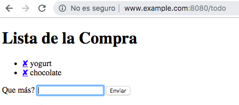

## Reto: Cookies, Sesiones, Autenticación y Módulos npm (p8-t3-sessions-and-modules)

Cree una web app usando express que gestione una lista *TODO* de cosas que hacer.
El cliente puede añadir y suprimir tareas a hacer.
Esta es la vista principal:



### Requisitos Básicos

* Podemos añadir elementos a la lista usando el formulario.  
* Podemos suprimir items haciendo click en las cruces en la lista.  
* La lista es almacenada en la session del visitante.  Si otro se conecta al site, tendrá su propia lista por cuanto está guardada en la session.

### La Vista

Este es el código de la vista en `ejs`:

**[~/javascript/expressjs/todo/my-todolist(master)]$ cat views/todo.ejs**

```html
<!DOCTYPE html>

<html>
    <head>
      <title><%= title %></title>
        <style>
            a {text-decoration: none; color: black;}
        </style>
    </head>

    <body>
      <h1><%= title %></h1>

        <ul>
        <% todolist.forEach(function(todo, index) { %>
            <li><a href="/todo/delete/<%= index %>">✘</a> <%= todo %></li>
        <% }); %>
        </ul>

        <form action="/todo/add/" method="post">
            <p>
                <label for="newtodo">Que más?</label>
                <input type="text" name="newtodo" id="newtodo" autofocus />
                <input type="submit" />
            </p>
        </form>
    </body>
</html>
```

### Middlewares a usar

Podemos usar express para el servidor, 
[EJS](https://ejs.co/#docs) para las vistas y como middlewares 

* [express-session](https://www.npmjs.com/package/express-session) y  
* [body-parser](https://www.npmjs.com/package/body-parser):

### Rutas que deberá implementar

Su aplicación deberá tener estas rutas:

* Listar las tareas: `/todo`
  - Cuando el request sea con `GET ` mostraremos la vista con la lista de tareas y el formulario
  - Cuando el request sea con `POST ` es que el formulario ha sido rellenado y enviado. Crearemos la tarea  y actualizaremos la vista 
* Añadir tareas: `/todo/add`
* Suprimir la tarea nº `id`:  `/todo/delete/:id:` 
* Cualquier otra ruta será redirigida a `/todo` ([vea el método `redirect` del objeto `response`](http://expressjs.com/es/api.html#res.redirect))

## Requsito adicional:  Implementar Middleware Contador de Nº de Visitas

Añada a su app un middleware que lleve la cuenta de los caminos de las rutas visitadas. Cada vez que una ruta es visitada muestre la cuenta en al consola del servidor

Puede que le sea útil alguno de estos módulos:

- [url-parse](https://www.npmjs.com/package/url-parse)
- [parseurl](https://www.npmjs.com/package/parseurl)

### Recursos para el Reto 

* [Documentación de Express](http://expressjs.com/en/api.html)
* [EJS](https://ejs.co/#docs) 
* [express-session](https://www.npmjs.com/package/express-session) y  
* [cookie-session](https://www.npmjs.com/package/cookie-session)
    - A user session can be stored in two main ways with cookies: on the server or on the client. 
* [parseurl](https://www.npmjs.com/package/parseurl)
* [url-parse](https://www.npmjs.com/package/url-parse)
    - cookie-session stores the session data on the client within a cookie, while a module like [express-session](https://www.npmjs.com/package/express-session) stores only a session identifier on the client within a cookie and stores the session data on the server, typically in a database.
* [body-parser](https://www.npmjs.com/package/body-parser)
* Repo de ejemplo [ULL-ESIT-DSI-1819/hello-cookies-and-sessions](https://github.com/ULL-ESIT-DSI-1819/hello-cookies-and-sessions)

