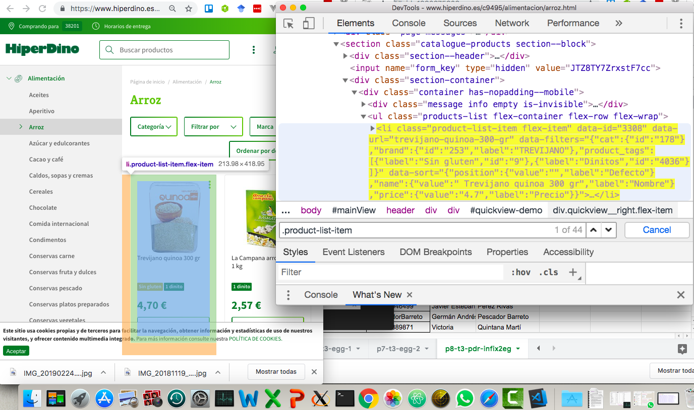
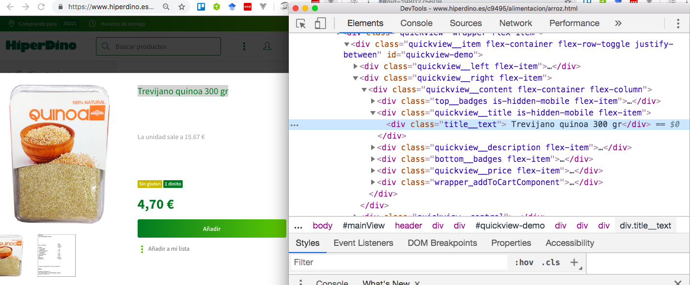
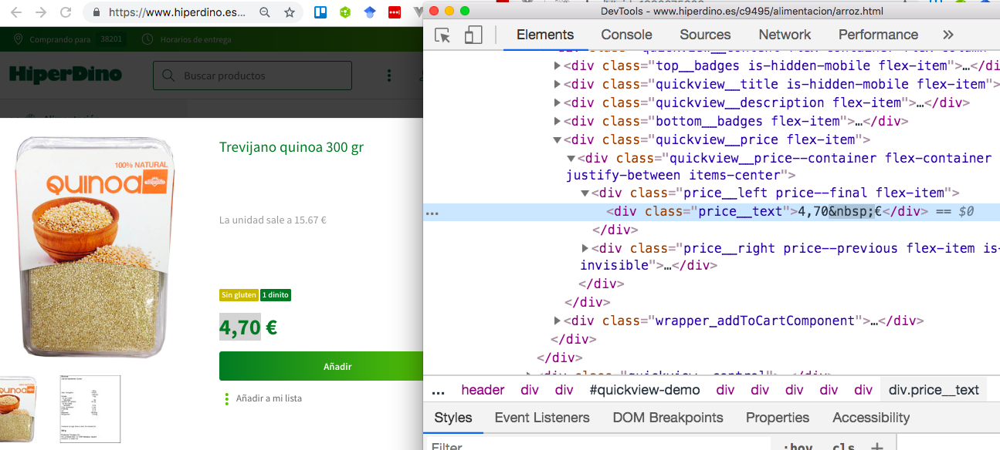

# Reto p9-t3-transfoming-data

Usando los módulos

* [request](https://www.npmjs.com/package/request)  o [request-promise](https://www.npmjs.com/package/request-promise) y 
* [cheerio](https://www.npmjs.com/package/cheerio), 

Escriba un  programa Node.js que se conecte a la página 
del supermercado Hiperdino y obtenga la lista de precios
de Hiperdino para una categoría de alimento pasado como argumento en línea de comandos. Algo similar a esto:

```
[~/TFGsrc/tfg-nicolangelo/tfg-nicolangelo-software(scra-pi)]$ ./hiperdino.js arroz
{4,70 €: Trevijano quinoa 300 gr}
{2,57 €: La Campana arroz basmati 1 kg}
{2,86 €: La Campana arroz bomba 1 kg}
{2,95 €: Nomen arroz basmati 1 kg}
{3,13 €: Nomen arroz bomba 1 kg}
{0,75 €: Nomen arroz coción rápida 250 gr}
...

```

Para obtener el precio del arroz nos conectaremos a la página

[https://online.hiperdino.es/c9495/alimentacion/arroz.html](https://online.hiperdino.es/c9495/alimentacion/arroz.html)

En general para una `categoria-de-alimento` 
será una URL como `https://online.hiperdino.es/c9495/alimentacion/categoria-de-alimento.html`

## Categorías de Alimentos de Hiperdino

Pruebe su programa con las entradas: 

* [arroz](https://online.hiperdino.es/c9495/alimentacion/arroz) 
* [aceites](https://online.hiperdino.es/c9495/alimentacion/aceites) 
* [azucar-y-edulcorantes](https://online.hiperdino.es/c9495/alimentacion/azucar-y-edulcorantes) 
* [cacao-y-cafe](https://online.hiperdino.es/c9495/alimentacion/cacao-y-cafe) 
* [conservas-fruta-y-dulces](https://online.hiperdino.es/c9495/alimentacion/conservas-fruta-y-dulces)

En general, se puede saber que categorías de alimentos están disponibles visitando la página
[https://www.hiperdino.es/](https://www.hiperdino.es/). Cuando visite esta página,
pulse inspeccionar estando sobre la categoría de alimento deseada y así podrá saber el nombre la página HTML:


De hecho un simple `grep` como este nos da la lista de categorías:

```
$ grep 'https://www.hiperdino.es/c9495/alimentacion/' hiperdino.md 

"https://www.hiperdino.es/c9495/alimentacion/aceites.html" rel=
"noreferrer noopener">https://www.hiperdino.es/c9495/alimentacion/aceites.html</a>"
"https://www.hiperdino.es/c9495/alimentacion/aperitivo.html" rel=
"noreferrer noopener">https://www.hiperdino.es/c9495/alimentacion/aperitivo.html</a>"
"https://www.hiperdino.es/c9495/alimentacion/arroz.html" rel=
"noreferrer noopener">https://www.hiperdino.es/c9495/alimentacion/arroz.html</a>"
"https://www.hiperdino.es/c9495/alimentacion/azucar-y-edulcorantes.html"
"noreferrer noopener">https://www.hiperdino.es/c9495/alimentacion/azucar-y-edulcorantes.html</a>"
"https://www.hiperdino.es/c9495/alimentacion/cacao-y-cafe.html"
rel="noreferrer noopener">https://www.hiperdino.es/c9495/alimentacion/cacao-y-cafe.html</a>"
"https://www.hiperdino.es/c9495/alimentacion/caldos-sopas-y-cremas.html"
"noreferrer noopener">https://www.hiperdino.es/c9495/alimentacion/caldos-sopas-y-cremas.html</a>"
"https://www.hiperdino.es/c9495/alimentacion/cereales.html" rel=
"noreferrer noopener">https://www.hiperdino.es/c9495/alimentacion/cereales.html</a>"
"https://www.hiperdino.es/c9495/alimentacion/chocolate.html" rel=
"noreferrer noopener">https://www.hiperdino.es/c9495/alimentacion/chocolate.html</a>"
"https://www.hiperdino.es/c9495/alimentacion/comida-internacional.html"
"noreferrer noopener">https://www.hiperdino.es/c9495/alimentacion/comida-internacional.html</a>"
"https://www.hiperdino.es/c9495/alimentacion/condimentos.html" rel=
"noreferrer noopener">https://www.hiperdino.es/c9495/alimentacion/condimentos.html</a>"
"https://www.hiperdino.es/c9495/alimentacion/conservas-carne.html"
...
```

## Sugerencias para Buscar la Descripción y Precio de un Item de una Categoría de Producto

A fecha de Mayo de 2019 la página de Hiperdino para una categoría de producto
`https://online.hiperdino.es/c9495/alimentacion/categoria-de-alimento.html`
tiene una estructura como sigue:

* Cada producto se describe en un elemento `div` con la clase `.product-list-item`

  

* La descripción del producto está en un `div` con la clase `.description__text`

  

* El precio aparece en un elemento `div`con la clase `.price__left` y dentro del mismo en un `div` con la clase
`.price__text`

  

## Recursos. Páginas Completas

* [Página Completa https://www.hiperdino.es/c9495/alimentacion/arroz.html](arroz.md) (Mayo 2019)
* [Página Completa https://www.hiperdino.es/c9495/](hiperdino.md) (Mayo 2019)
