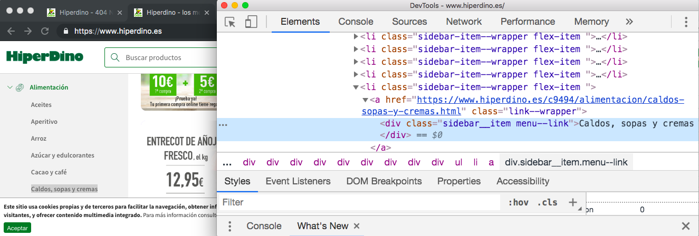

# Reto p9-t3-transfoming-data

Usando los módulos

* [request](https://www.npmjs.com/package/request)  o [request-promise](https://www.npmjs.com/package/request-promise) y 
* [cheerio](https://www.npmjs.com/package/cheerio), 

Escriba un  programa Node.js que se conecte a la página 
del supermercado Hiperdino y obtenga la lista de precios
de hiperdino para una categoría de alimento pasado como argumento en línea de comandos. Algo similar a esto:

```
[~/TFGsrc/tfg-nicolangelo/tfg-nicolangelo-software(scra-pi)]$ ./hiperdino.js arroz
{4,70 €: Trevijano quinoa 300 gr}
{2,57 €: La Campana arroz basmati 1 kg}
{2,86 €: La Campana arroz bomba 1 kg}
{2,95 €: Nomen arroz basmati 1 kg}
{3,13 €: Nomen arroz bomba 1 kg}
{0,75 €: Nomen arroz coción rápida 250 gr}
...

```

Para obtener el precio del arroz nos conectaremos a la página

[https://online.hiperdino.es/c9495/alimentacion/arroz.html](https://online.hiperdino.es/c9495/alimentacion/arroz.html)

En general para una `categoria-de-alimento` 
será una URL como `https://online.hiperdino.es/c9495/alimentacion/categoria-de-alimento.html`

## Categorías de Alimentos de Hiperdino

Pruebe su programa con las entradas: 

* arroz, 
* aceites, 
* azucar-y-edulcorantes, 
* cacao-y-cafe, 
* conservas-fruta-y-dulces.

En general, se puede saber que categorías de alimentos están disponibles en la página
[https://www.hiperdino.es/](https://www.hiperdino.es/). Cuando visite la página,
pulse inspeccionar estando sobre la categoría de alimento deseada:



